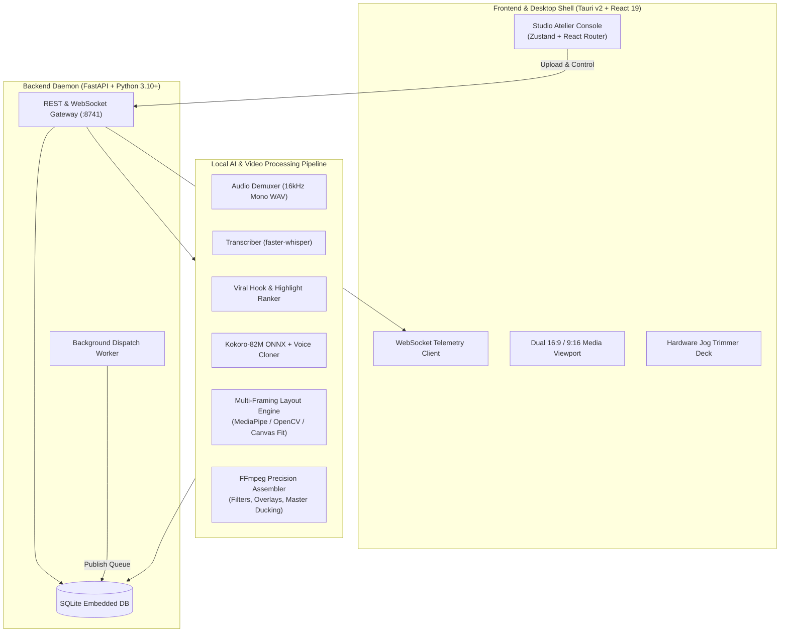

# 🎩 Alfred — Offline-First AI Content Repurposing & Distribution Engine

> Transform 60-minute long-form horizontal videos (keynotes, podcasts, technical talks) into high-retention, broadcast-ready 9:16 vertical shorts — 100% locally, with zero cloud API fees, zero telemetry, and complete data privacy.

---

## 📑 Table of Contents

- [Overview](#-overview)
- [System Architecture](#-system-architecture)
- [Complete Processing Workflow](#-complete-processing-workflow)
- [Key Features](#-key-features)
  - [1. Ingestion Bay & Telemetry](#1-ingestion-bay--telemetry)
  - [2. Multi-Model AI Highlight Extraction & Viral Scoring](#2-multi-model-ai-highlight-extraction--viral-scoring)
  - [3. Multi-Framing 9:16 Layout Engine (Zero Slide Cutoff)](#3-multi-framing-916-layout-engine-zero-slide-cutoff)
  - [4. Hardware-Style NLE Precision Jog Deck](#4-hardware-style-nle-precision-jog-deck)
  - [5. Audio Master Routing & Dialogue Isolation](#5-audio-master-routing--dialogue-isolation)
  - [6. Kokoro-82M Voice Cloning & Narration Studio](#6-kokoro-82m-voice-cloning--narration-studio)
  - [7. Mute-Proof Visual Hook Engine](#7-mute-proof-visual-hook-engine)
  - [8. Social Broadcast Scheduler & Account Dispatch](#8-social-broadcast-scheduler--account-dispatch)
  - [9. Studio Atelier Design Language](#9-studio-atelier-design-language)
- [Directory Structure](#-directory-structure)
- [Prerequisites](#-prerequisites)
- [Installation & Quickstart Guide](#-installation--quickstart-guide)
  - [1. Clone Repository](#1-clone-repository)
  - [2. System Dependencies](#2-system-dependencies)
  - [3. Backend Setup (Python + uv)](#3-backend-setup-python--uv)
  - [4. Frontend Setup (React + Vite)](#4-frontend-setup-react--vite)
  - [5. Desktop App Setup (Tauri v2)](#5-desktop-app-setup-tauri-v2)
- [Step-by-Step Usage Guide](#-step-by-step-usage-guide)
- [API Reference](#-api-reference)
- [Configuration & Settings](#-configuration--settings)
- [License](#-license)

---

## 💡 Overview

Producing vertical video content (TikTok, YouTube Shorts, Instagram Reels) from long-form technical lectures, keynotes, and podcasts is historically labor-intensive. Editors must manually sift through hours of footage, hunt for engaging hooks, crop 16:9 widescreen footage into 9:16 vertical without cutting off slides or speaker faces, burn in subtitles, and record introductory voiceovers.

**Alfred** automates this entire pipeline locally on your machine:
- **Offline & Private**: Uses local ONNX models, local Whisper transcription, and local FFmpeg rendering. Your source video never leaves your workstation.
- **Presentation-Aware**: Solves the common vertical crop problem where technical slides, code editors, and presentation text get sliced off.
- **Zero Audio Collisions**: Clean separation between natural speaker dialogue and synthesized hook voiceovers.
- **Editorial Polish**: Features a dedicated editorial console with frame-accurate timeline trimming, audio master ducking, and safe-zone headline overlays.

---

## 🏛️ System Architecture

Alfred is architected as a native desktop application with a high-performance **Tauri v2** shell, a **React 19** frontend, and a high-concurrency **FastAPI** Python daemon coordinating local AI models and FFmpeg.



---

## 🔄 Complete Processing Workflow

```mermaid
sequenceDiagram
    autonumber
    actor User as Video Editor
    participant Ingest as Ingest Bay
    participant Backend as FastAPI Server
    participant Pipeline as AI Processing Pipeline
    participant Review as Editorial Review Console
    participant Schedule as Social Scheduler

    User->>Ingest: Drag & drop 16:9 master video (e.g., TEDx talk)
    Ingest->>Backend: POST /api/jobs (video_path, clip_count)
    Backend-->>Ingest: Return job_id + connect WebSocket (/ws)
    
    rect rgb(20, 22, 28)
        note over Backend,Pipeline: 6-Stage Automated AI Extraction Pipeline
        Backend->>Pipeline: Stage 1: Demux audio track (16kHz mono WAV)
        Backend->>Pipeline: Stage 2: Transcribe with word-level timestamps (faster-whisper)
        Backend->>Pipeline: Stage 3: Score virality & identify top highlight boundaries
        Backend->>Pipeline: Stage 4: Generate attention hook scripts (spoken & visual)
        Backend->>Pipeline: Stage 5: Synthesize narration voice / cloned profile (Kokoro ONNX)
        Backend->>Pipeline: Stage 6: Render 9:16 cutdowns with framing layout & audio mode
    end

    Pipeline-->>Backend: Save clips (status: pending_review)
    Backend-->>Ingest: WS Event: job_completed (5 clips ready)
    Ingest-->>User: Auto-transition to Editorial Review Console

    User->>Review: Inspect side-by-side (16:9 Master vs 9:16 Smartphone preview)
    User->>Review: Nudge in/out points on Jog Deck (-1s / +1s)
    User->>Review: Select Framing Mode (Canvas Fit / Stacked Split / Face Focus)
    User->>Review: Select Audio Mode (Clean Dialogue / Pre-roll / Ducked)
    User->>Review: Click "Apply & Re-Render Cut"
    Review->>Backend: POST /api/clips/{id}/rerender
    Backend-->>Review: Clip re-assembled with custom boundaries

    User->>Review: Click "Approve Cut"
    User->>Schedule: Schedule to Social Broadcast (YouTube, IG, TikTok, LinkedIn, X)
```



---

## ✨ Key Features

### 1. Ingestion Bay & Telemetry
- **File Ingest**: Instant drag-and-drop intake of raw video footage (`.mp4`, `.mov`, `.mkv`, `.webm`).
- **Telemetry Console**: Real-time pipeline status streamed via WebSockets, displaying stage indicators, elapsed runtimes, and live logs.
- **Job Recovery**: Persists job metadata in local SQLite, allowing projects to be re-opened across desktop sessions.

### 2. Multi-Model AI Highlight Extraction & Viral Scoring
- **Speech-to-Text**: High-speed, word-level audio transcription utilizing `faster-whisper`.
- **Heuristic & Semantic Scoring**: Identifies peak narrative tension, strong thesis statements, punchy questions, and audience reactions.
- **Clean Sentence Boundaries**: Avoids awkward mid-sentence cutoffs by snapping slice boundaries to punctuation and natural pauses.

### 3. Multi-Framing 9:16 Layout Engine (Zero Slide Cutoff)
Standard video croppers blind-crop the center 9:16 vertical slice, chopping off 60% of technical slides. Alfred offers three distinct presentation framing strategies:
- 📺 **Canvas Fit (`presentation_fit`)**: Places the full 16:9 widescreen canvas inside the vertical 9:16 frame with subtle dark-letterbox padding. **100% of slides, code snippets, diagrams, and presenter subtitles remain visible.**
- 📑 **Stacked Split (`split_screen`)**: Creates a vertical dual-stack with the speaker’s talking head on top and the slide presentation on the bottom.
- 👤 **Face Focus (`face_focus`)**: Uses computer vision to crop and track the speaker's face for talking-head-only segments.

### 4. Hardware-Style NLE Precision Jog Deck
Inspired by pro NLE hardware (DaVinci Resolve, Frame.io, Teenage Engineering OP-1):
- **Micro-Nudge Controls**: Dedicated `-5s`, `-1s`, `+1s`, and `+5s` jog buttons for both In-Point and Out-Point.
- **Monospace Timecodes**: High-precision display formatted in `MM:SS.ms` and raw seconds.
- **Active Duration Indicator**: Live duration calculation (`trimEnd - trimStart`).
- **One-Click Re-Render**: Directly re-renders the clip with new cut boundaries in seconds.

### 5. Audio Master Routing & Dialogue Isolation
Prevents synthetic AI voiceovers from clashing with the speaker’s original words:
- 🎙️ **Clean Dialogue (`original`)**: Preserves the natural speaker audio track with 100% fidelity and zero artificial voice collision (default).
- ⚡ **Pre-Roll Hook (`preroll`)**: Inserts a 2.5-second synthetic voice narration buffer *before* speaker dialogue commences.
- 🎚️ **Ducked Voiceover (`voiceover`)**: Dynamically ducks master speaker audio under synthesized narration.

### 6. Kokoro-82M Voice Cloning & Narration Studio
- **Ultra-Fast Local TTS**: Integrated **Kokoro-82M ONNX** engine running locally on CPU or GPU.
- **Vocal Presets**: High-fidelity voices including `Heart` (Female), `Adam` (Male), `Bella` (Expressive), and `Michael` (Studio).
- **Voice Cloning Profile**: Clones vocal timber from 5-second clean reference slices without cloud dependencies.
- **Isolated Audition Player**: Dedicated audio player allowing you to preview and re-generate voice tracks independently before baking into video.

### 7. Mute-Proof Visual Hook Engine
Over 80% of social feeds are scrolled on mute:
- **Upper 22% Safe Zone**: Generates high-contrast, uppercase headline badges positioned in the top 22% safe-zone above TikTok/Instagram UI controls.
- **Kinetic Punch-In Zoom**: Applies a 1.15x smooth zoom during the first 2.5 seconds to interrupt passive scrolling before audio is heard.

### 8. Social Broadcast Scheduler & Account Dispatch
- **Multi-Platform Support**: Target YouTube Shorts, Instagram Reels, TikTok, LinkedIn, and X (Twitter).
- **Interactive Calendar Grid**: Architectural 7-day grid showing scheduled broadcasts with platform-specific badges.
- **Background Worker**: Automated background scheduler loop that evaluates publishing queues. Includes a mock publishing engine for offline testing.

### 9. Studio Atelier Design Language
Crafted with inspiration from the **Frans Hals Museum** (Dutch linen typography, warm vermilion terracotta accents, architectural hairlines) and **Teenage Engineering** (monospace timecodes, tactile segment groups, high-density hardware consoles).

---

## 📁 Directory Structure

```text
Alfred/
├── backend/                  # FastAPI Python backend daemon
│   ├── main.py               # FastAPI application entry point & static file server
│   ├── config.py             # System paths, server ports, and model configurations
│   ├── database.py           # SQLite asynchronous database schema & models
│   ├── pipeline/             # Core local AI processing modules
│   │   ├── transcriber.py    # Speech-to-text engine (faster-whisper)
│   │   ├── analyzer.py       # Highlight ranker & viral scoring algorithms
│   │   ├── hook_generator.py # Spoken & visual attention hook generator
│   │   ├── tts.py            # Kokoro-82M ONNX TTS & Voice Cloner
│   │   ├── smart_crop.py     # 9:16 Framing & face-tracking logic
│   │   ├── assembler.py      # FFmpeg video slicer, master ducking, & subtitle burn
│   │   └── orchestrator.py   # Multi-stage pipeline job orchestrator
│   ├── routers/              # REST & WebSocket endpoints
│   │   ├── jobs.py           # Ingest jobs & telemetry
│   │   ├── clips.py          # Clip management, re-rendering, & voice synthesis
│   │   ├── schedule.py       # Broadcast calendar & scheduled posts
│   │   ├── accounts.py       # Connected social accounts
│   │   ├── settings.py       # System settings & model preferences
│   │   └── ws.py             # Real-time WebSocket telemetry gateway
│   ├── scheduler/            # Background cron dispatch loop
│   ├── uploaders/            # Social media upload adapters (YouTube, Mock, etc.)
│   ├── pyproject.toml        # Backend dependencies managed by uv
│   └── uv.lock               # Deterministic dependency lockfile
├── src/                      # Frontend application (React 19 + TypeScript + Vite)
│   ├── views/                # Primary application screens
│   │   ├── Dashboard.tsx     # Metric overview & quick action hub
│   │   ├── Process.tsx       # Ingestion Bay & live telemetry viewer
│   │   ├── Review.tsx        # Side-by-side Editorial Review & Jog Deck Console
│   │   ├── Calendar.tsx      # Social Broadcast Calendar & scheduler
│   │   └── Settings.tsx      # Local AI model, voice, & system configuration
│   ├── components/           # Reusable UI components & SVG icons
│   ├── stores/               # Zustand state stores (jobs, clips, schedule, settings)
│   ├── services/             # Axios API client & WebSocket connector
│   ├── types/                # TypeScript interfaces (Job, Clip, FramingMode, etc.)
│   ├── index.css             # Studio Atelier Design System tokens & layout classes
│   └── App.tsx               # Root layout & client router
├── src-tauri/                # Native desktop shell (Tauri v2 + Rust)
│   ├── src/main.rs           # Rust entry point
│   ├── Cargo.toml            # Rust dependencies
│   └── tauri.conf.json       # Desktop window configuration & permissions
├── docs/                     # Specifications and PRD
├── package.json              # Frontend scripts & dependencies
└── vite.config.ts            # Vite bundler configuration
```

---

## 🛠️ Prerequisites

Before getting started, ensure your system has the following tools installed:

1. **Operating System**: Linux (Ubuntu 20.04+ / Arch / Fedora), macOS (Apple Silicon or Intel), or Windows (WSL2 recommended).
2. **FFmpeg & FFprobe**: Required for media demuxing, audio ducking, and video assembly.
   ```bash
   # Ubuntu/Debian
   sudo apt update && sudo apt install -y ffmpeg

   # Arch Linux
   sudo pacman -S ffmpeg

   # macOS (Homebrew)
   brew install ffmpeg
   ```
3. **Python 3.10+**: Ensure Python is installed.
4. **uv**: Modern, fast Python package and environment manager.
   ```bash
   curl -LsSf https://astral.sh/uv/install.sh | sh
   ```
5. **Node.js 18+ and npm**:
   ```bash
   # Verify node installation
   node -v
   npm -v
   ```
6. **Rust & Cargo** *(Optional — only required to build native Tauri desktop binaries)*:
   ```bash
   curl --proto '=https' --tlsv1.2 -sSf https://sh.rustup.rs | sh
   ```

---

## 🚀 Installation & Quickstart Guide

### 1. Clone Repository

```bash
git clone https://github.com/DivyamJoshi2005/Alfred.git
cd Alfred
```

### 2. System Dependencies

Verify that `ffmpeg` is available on your PATH:

```bash
ffmpeg -version
```

### 3. Backend Setup (Python + uv)

Alfred's backend uses `uv` to manage virtual environments and dependencies deterministically.

```bash
cd backend

# Install all dependencies (FastAPI, PyTorch, faster-whisper, onnxruntime, etc.)
uv sync

# Launch backend server (runs at http://127.0.0.1:8741)
uv run python main.py
```

*The backend creates its SQLite database (`alfred.db`) and storage directories automatically on first startup.*

### 4. Frontend Setup (React + Vite)

In a separate terminal:

```bash
# Return to repository root
cd Alfred

# Install frontend dependencies
npm install

# Run Vite development server
npm run dev
```

*Access the Studio UI in your browser at `http://localhost:5173`.*

### 5. Desktop App Setup (Tauri v2)

To run Alfred as a native, borderless desktop application:

```bash
npm run tauri dev
```

To compile an optimized release binary for your platform:

```bash
npm run tauri build
```

---

## 📖 Step-by-Step Usage Guide

### Step 1: Ingest Master Video
1. Open Alfred and navigate to the **Ingest Bay** (`/process`).
2. Drag and drop your long-form 16:9 widescreen video (e.g., a keynote, podcast, or tutorial).
3. Select your desired number of highlight clips (default: 5 clips) and click **"Start Extraction Pipeline"**.

### Step 2: Live Pipeline Telemetry
1. The Ingest Bay displays live telemetry as Alfred executes the 6-stage pipeline:
   - `Demuxing Audio`: Strips 16kHz mono audio.
   - `Transcribing`: Transcribes audio with word-level timestamps.
   - `Scoring Virality`: Identifies high-tension segments.
   - `Generating Attention Hooks`: Formulates spoken and visual hooks.
   - `Synthesizing Voice`: Prepares synthetic hook audio.
   - `Assembling 9:16 Cutdowns`: Crops and renders 1080×1920 MP4 files.
2. When processing finishes, you are automatically directed to the **Editorial Review Console**.

### Step 3: Review & Fine-Tune Cuts
1. In the **Editorial Review Console** (`/review`), use the top rail to switch between generated clips (`CLIP [01]`, `CLIP [02]`, etc.).
2. Compare the original 16:9 master footage against the vertical 9:16 smartphone viewport side-by-side.

### Step 4: Adjust Boundaries on the Jog Deck
1. Use the **Hardware Jog Trimmer Deck** directly beneath the video preview to adjust In-Point and Out-Point boundaries with frame precision:
   - Click `-5s`, `-1s`, `+1s`, or `+5s` to nudge boundaries.
   - Or type specific seconds directly into the numeric timecode inputs.
2. The active duration pill dynamically updates.

### Step 5: Choose Framing & Audio Master Mode
1. **9:16 Video Framing**:
   - Select `📺 Canvas Fit` for keynotes/talks so technical slides and code diagrams are 100% visible with zero boundary cutoff.
   - Select `📑 Stacked Split` to display the presenter above the slide presentation.
   - Select `👤 Face Focus` for talking-head-only clips.
2. **Audio Master Track**:
   - Choose `🎙️ Clean Dialogue` to preserve the speaker's original audio without any synthetic voiceover collision.
   - Choose `⚡ Pre-Roll Hook` to play a 2.5-second intro before speaker speech begins.
   - Choose `🎚️ Ducked Voice` to duck speaker audio under synthetic narration.
3. Click **"Apply & Re-Render Cut"** to compile your changes.

### Step 6: Customize Voice & Headline Badges
1. Edit the **Attention Hook Script** in the right-hand studio card.
2. Select a Kokoro voice preset or enable **"Cloned Voice"** and click **"Synthesize Track"**.
3. Audition the synthesized audio independently in the audition player.
4. Verify the uppercase headline badge in the **Upper 22% Safe Zone** preview.

### Step 7: Approve & Broadcast
1. Click **"Approve Cut"**.
2. Click **"Schedule to Social Broadcast →"** to assign a publication date, target social channels, and add post captions.

---

## 📡 API Reference

The backend daemon exposes a comprehensive REST and WebSocket interface:

| Method | Endpoint | Description |
| :--- | :--- | :--- |
| `GET` | `/api/health` | Health check & daemon status |
| `GET` | `/api/jobs` | List all historical ingestion jobs |
| `POST` | `/api/jobs` | Create and trigger a new video repurposing job |
| `GET` | `/api/jobs/{id}` | Retrieve job status, stage, and telemetry |
| `DELETE` | `/api/jobs/{id}` | Delete job and associated video assets |
| `GET` | `/api/clips/job/{job_id}` | Retrieve all extracted clips for a specific job |
| `PATCH` | `/api/clips/{id}` | Update clip status (`approved`, `rejected`) or hook text |
| `POST` | `/api/clips/{id}/rerender` | Re-render clip with custom in/out boundaries, framing mode, & audio mode |
| `POST` | `/api/clips/{id}/synthesize-voice` | Synthesize Kokoro or cloned voiceover track |
| `GET` | `/api/media?path=...` | Stream local video and audio files to the frontend player |
| `GET` | `/api/schedule` | Retrieve all scheduled calendar broadcasts |
| `POST` | `/api/schedule` | Schedule a clip for publication |
| `GET` | `/api/accounts` | List configured social platform accounts |
| `POST` | `/api/accounts` | Connect a new social account profile |
| `GET` | `/api/settings` | Retrieve user preferences and model configurations |
| `POST` | `/api/settings` | Save system and AI engine configurations |
| `WS` | `/ws` | Real-time bi-directional pipeline telemetry channel |

---

## ⚙️ Configuration & Settings

System defaults are configured in `backend/config.py` and can be customized via environment variables:

| Variable | Default | Description |
| :--- | :--- | :--- |
| `ALFRED_SERVER_HOST` | `127.0.0.1` | Local backend bind address |
| `ALFRED_SERVER_PORT` | `8741` | Daemon HTTP & WebSocket port |
| `ALFRED_BASE_DIR` | `~/Alfred` | Directory for rendered projects, clips, and cache |
| `ALFRED_WHISPER_MODEL` | `small` | Faster-Whisper model size (`tiny`, `base`, `small`, `medium`) |
| `ALFRED_DEVICE` | `cpu` | Computation device (`cpu` or `cuda`) |
| `ALFRED_COMPUTE_TYPE` | `int8` | Quantization type for inference (`int8`, `float16`) |
| `ALFRED_TTS_PRESET` | `af_heart` | Default Kokoro voice preset |

---

## 📄 License

This project is licensed under the **MIT License**. See the [LICENSE](LICENSE) file for full details.

---

<p align="center">
  <b>Alfred</b> — Built with care for video creators, educators, and technical speakers.
</p>
