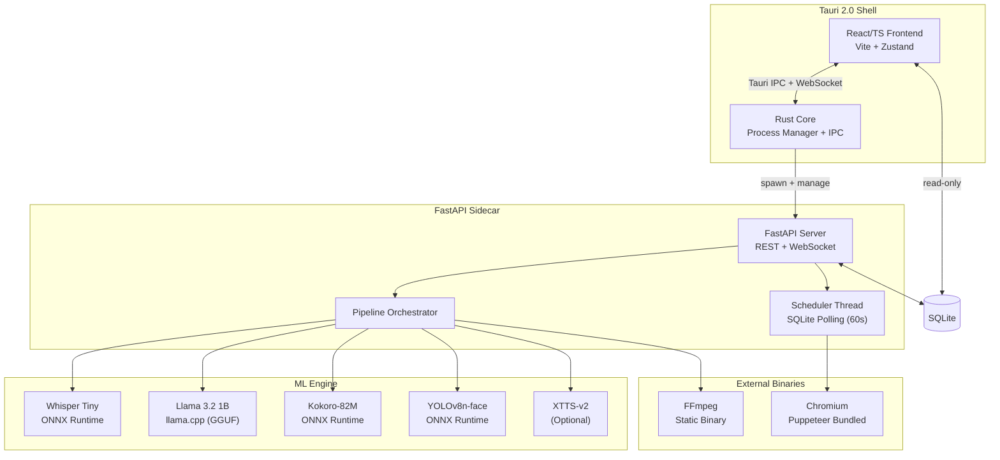
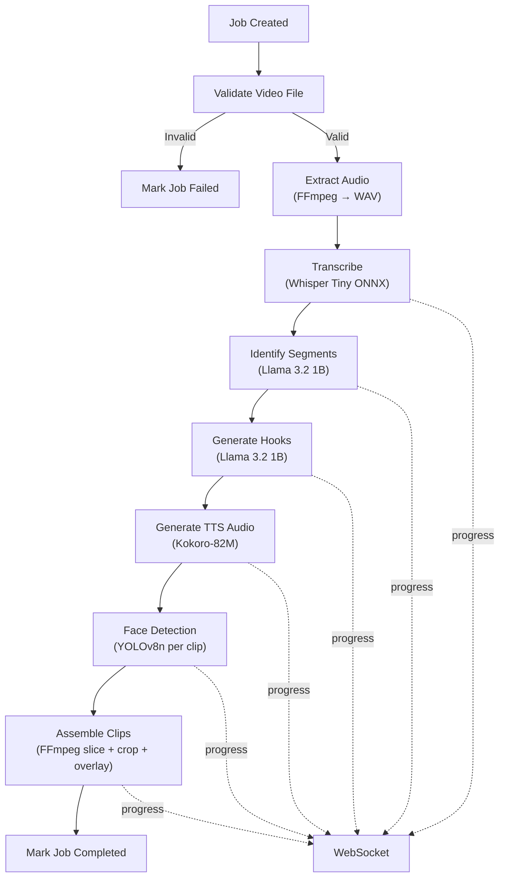

# Alfred — Technical Specifications

**Version:** 1.0  
**Date:** 2026-08-26  
**Status:** Draft — Pending Approval  

---

## 1. System Overview

Alfred is a desktop application composed of three tightly integrated layers:

1. **Tauri 2.0 Shell** (Rust + React/TypeScript) — the native window, IPC, and process manager
2. **FastAPI Sidecar** (Python, compiled via PyInstaller) — the orchestration server and ML pipeline
3. **Bundled Binaries** — FFmpeg, Chromium, and ML model files



---

## 2. Technology Stack

### 2.1 Frontend

| Component | Technology | Version | Purpose |
|---|---|---|---|
| Framework | React | 18.x | UI component framework |
| Language | TypeScript | 5.x | Type-safe frontend development |
| Build tool | Vite | 6.x | Fast HMR, minimal bundle |
| State management | Zustand | 5.x | Lightweight reactive state |
| Styling | Vanilla CSS | — | Custom dark theme, no framework overhead |
| Desktop shell | Tauri | 2.x | Native window, IPC, sidecar management |

### 2.2 Backend (Sidecar)

| Component | Technology | Version | Purpose |
|---|---|---|---|
| API framework | FastAPI | 0.115.x | REST endpoints + WebSocket |
| Database | SQLite | 3.x | Jobs, schedules, transcripts, state |
| ORM/Query | aiosqlite | 0.21.x | Async SQLite access |
| ML inference (text) | llama-cpp-python | 0.3.x | Llama 3.2 1B GGUF inference |
| ML inference (media) | onnxruntime | 1.20.x | Whisper, Kokoro, YOLO inference |
| Browser automation | Pyppeteer / Playwright | latest | Headless Chromium uploads |
| Packaging | PyInstaller | 6.x | Compile to standalone binary |

### 2.3 ML Models

| Model | Format | Size | Quantization | Purpose |
|---|---|---|---|---|
| Whisper Tiny | ONNX | ~75 MB | FP16 | Audio transcription with word timestamps |
| Llama 3.2 1B | GGUF | ~700 MB | Q4_K_M | Segment selection + hook generation |
| Kokoro-82M | ONNX | ~170 MB | FP16 | Text-to-speech for hook narration |
| YOLOv8n-face | ONNX | ~12 MB | FP32 | Face detection for smart cropping |
| XTTS-v2 | PyTorch/ONNX | ~1.8 GB | FP16 | Voice cloning (optional download) |

**Total core footprint:** ~957 MB models + ~100 MB FFmpeg + ~150 MB Chromium + ~50 MB app = **~1.26 GB**

### 2.4 External Binaries

| Binary | Distribution | Size | Source |
|---|---|---|---|
| FFmpeg | Static build, bundled | ~80-100 MB | [ffmpeg.org static builds](https://ffmpeg.org/download.html) |
| Chromium | Puppeteer bundled browser | ~150-200 MB | Puppeteer's `@puppeteer/browsers` |

---

## 3. Directory Structure

```
Alfred/
├── src-tauri/                    # Rust backend (Tauri core)
│   ├── src/
│   │   ├── main.rs              # Entry point, sidecar spawn
│   │   ├── commands.rs          # Tauri IPC commands
│   │   └── lib.rs
│   ├── binaries/                # Bundled sidecar + FFmpeg
│   ├── icons/
│   ├── tauri.conf.json
│   └── Cargo.toml
│
├── src/                         # React/TypeScript frontend
│   ├── main.tsx                 # App entry
│   ├── App.tsx                  # Router + layout shell
│   ├── index.css                # Global styles + design tokens
│   ├── components/
│   │   ├── Sidebar.tsx          # Navigation sidebar
│   │   ├── VideoPlayer.tsx      # HTML5 video player component
│   │   ├── ProgressBar.tsx      # Pipeline progress indicator
│   │   ├── CalendarView.tsx     # Scheduling calendar
│   │   ├── ClipCard.tsx         # Clip preview card
│   │   ├── DragDropZone.tsx     # File ingestion zone
│   │   └── TranscriptViewer.tsx # Highlighted transcript display
│   ├── views/
│   │   ├── Dashboard.tsx        # Overview + recent jobs
│   │   ├── Process.tsx          # Video ingestion + pipeline progress
│   │   ├── Review.tsx           # Side-by-side clip review
│   │   ├── Calendar.tsx         # Schedule management
│   │   └── Settings.tsx         # Social accounts + configuration
│   ├── stores/
│   │   ├── jobStore.ts          # Job queue state (Zustand)
│   │   ├── clipStore.ts         # Clip review state
│   │   ├── scheduleStore.ts     # Calendar/schedule state
│   │   └── settingsStore.ts     # App settings state
│   ├── hooks/
│   │   ├── useWebSocket.ts      # WebSocket connection + message handler
│   │   └── useVideoMeta.ts      # Video metadata extraction
│   ├── services/
│   │   ├── api.ts               # FastAPI REST client
│   │   └── tauri.ts             # Tauri IPC wrappers
│   └── types/
│       ├── job.ts               # Job, Clip, Segment types
│       ├── schedule.ts          # ScheduledPost, Platform types
│       └── ws.ts                # WebSocket message types
│
├── backend/                     # Python FastAPI sidecar
│   ├── main.py                  # FastAPI app entry, lifespan events
│   ├── config.py                # Paths, model configs, constants
│   ├── database.py              # SQLite schema + async access
│   ├── models/                  # SQLAlchemy/Pydantic models
│   │   ├── job.py
│   │   ├── clip.py
│   │   ├── schedule.py
│   │   └── transcript.py
│   ├── routers/
│   │   ├── jobs.py              # POST /jobs, GET /jobs/{id}
│   │   ├── clips.py             # GET /clips, PATCH /clips/{id}
│   │   ├── schedule.py          # POST /schedule, DELETE /schedule/{id}
│   │   ├── upload.py            # POST /upload/connect, GET /upload/status
│   │   └── ws.py                # WebSocket endpoint
│   ├── pipeline/
│   │   ├── orchestrator.py      # Sequential pipeline execution
│   │   ├── transcriber.py       # Whisper Tiny ONNX inference
│   │   ├── analyzer.py          # Llama 3.2 1B segment selection
│   │   ├── hook_generator.py    # Llama 3.2 1B hook text generation
│   │   ├── tts.py               # Kokoro-82M TTS
│   │   ├── voice_cloner.py      # XTTS-v2 voice cloning (optional)
│   │   ├── smart_crop.py        # YOLOv8n-face detection + crop coords
│   │   └── assembler.py         # FFmpeg video assembly
│   ├── scheduler/
│   │   ├── scheduler.py         # SQLite polling loop (60s)
│   │   └── uploader.py          # Puppeteer upload automation
│   ├── uploaders/
│   │   ├── youtube.py           # YouTube upload script
│   │   ├── instagram.py         # Instagram Reels upload script
│   │   └── twitter.py           # X (Twitter) upload script
│   └── requirements.txt
│
├── models/                      # ML model files (bundled)
│   ├── whisper-tiny.onnx
│   ├── llama-3.2-1b.Q4_K_M.gguf
│   ├── kokoro-82m.onnx
│   └── yolov8n-face.onnx
│
├── docs/
│   ├── PRD.md
│   └── SPECS.md                 # ← This file
│
├── package.json
├── tsconfig.json
├── vite.config.ts
└── README.md
```

---

## 4. Database Schema (SQLite)

```sql
-- Core job tracking
CREATE TABLE jobs (
    id          TEXT PRIMARY KEY,           -- UUID
    video_path  TEXT NOT NULL,              -- Absolute path to source video
    video_name  TEXT NOT NULL,              -- Display name
    status      TEXT NOT NULL DEFAULT 'queued',  -- queued | transcribing | analyzing | rendering | completed | failed
    created_at  DATETIME DEFAULT CURRENT_TIMESTAMP,
    updated_at  DATETIME DEFAULT CURRENT_TIMESTAMP,
    error_msg   TEXT                        -- Error details if failed
);

-- Whisper transcription output
CREATE TABLE transcripts (
    id          TEXT PRIMARY KEY,
    job_id      TEXT NOT NULL REFERENCES jobs(id),
    full_text   TEXT NOT NULL,              -- Complete transcript text
    segments    TEXT NOT NULL,              -- JSON array of {start, end, text} segments
    words       TEXT NOT NULL,              -- JSON array of {start, end, word} word-level timestamps
    created_at  DATETIME DEFAULT CURRENT_TIMESTAMP
);

-- AI-identified clip segments
CREATE TABLE clips (
    id              TEXT PRIMARY KEY,
    job_id          TEXT NOT NULL REFERENCES jobs(id),
    rank            INTEGER NOT NULL,       -- 1 = best viral potential
    start_time      REAL NOT NULL,          -- Seconds
    end_time        REAL NOT NULL,          -- Seconds
    duration        REAL NOT NULL,          -- Seconds
    transcript_text TEXT NOT NULL,          -- Transcript slice for this segment
    hook_text       TEXT,                   -- Generated hook script
    hook_audio_path TEXT,                   -- Path to TTS audio file
    output_path     TEXT,                   -- Path to rendered clip MP4
    status          TEXT DEFAULT 'pending', -- pending | rendering | rendered | approved | rejected
    rationale       TEXT,                   -- Why this segment was selected
    created_at      DATETIME DEFAULT CURRENT_TIMESTAMP
);

-- Scheduled social media posts
CREATE TABLE scheduled_posts (
    id              TEXT PRIMARY KEY,
    clip_id         TEXT NOT NULL REFERENCES clips(id),
    platform        TEXT NOT NULL,          -- youtube | instagram | twitter
    scheduled_at    DATETIME NOT NULL,      -- When to upload
    title           TEXT,
    description     TEXT,
    tags            TEXT,                   -- Comma-separated tags
    status          TEXT DEFAULT 'scheduled', -- scheduled | uploading | uploaded | failed
    attempts        INTEGER DEFAULT 0,
    last_error      TEXT,
    created_at      DATETIME DEFAULT CURRENT_TIMESTAMP,
    updated_at      DATETIME DEFAULT CURRENT_TIMESTAMP
);

-- Social account browser profiles
CREATE TABLE social_accounts (
    id              TEXT PRIMARY KEY,
    platform        TEXT NOT NULL UNIQUE,   -- youtube | instagram | twitter
    profile_path    TEXT NOT NULL,           -- Path to Chromium user data dir
    display_name    TEXT,                   -- e.g., "My YouTube Channel"
    connected_at    DATETIME DEFAULT CURRENT_TIMESTAMP,
    last_used_at    DATETIME
);

-- Application settings
CREATE TABLE settings (
    key     TEXT PRIMARY KEY,
    value   TEXT NOT NULL
);
```

---

## 5. API Specification (FastAPI)

### 5.1 REST Endpoints

#### Jobs

| Method | Path | Description | Request Body | Response |
|---|---|---|---|---|
| `POST` | `/api/jobs` | Create a new processing job | `{ video_path: string }` | `{ job_id: string, status: string }` |
| `GET` | `/api/jobs` | List all jobs | — | `Job[]` |
| `GET` | `/api/jobs/{id}` | Get job details + clips | — | `Job & { clips: Clip[] }` |
| `DELETE` | `/api/jobs/{id}` | Cancel/delete a job | — | `{ success: bool }` |

#### Clips

| Method | Path | Description | Request Body | Response |
|---|---|---|---|---|
| `GET` | `/api/jobs/{job_id}/clips` | List clips for a job | — | `Clip[]` |
| `PATCH` | `/api/clips/{id}` | Update clip (approve/reject, edit hook) | `{ status?, hook_text? }` | `Clip` |
| `POST` | `/api/clips/{id}/regenerate-hook` | Regenerate hook for a clip | — | `{ hook_text: string }` |
| `POST` | `/api/clips/{id}/preview-tts` | Preview TTS for a hook | `{ voice_preset? }` | Binary audio stream |

#### Schedule

| Method | Path | Description | Request Body | Response |
|---|---|---|---|---|
| `POST` | `/api/schedule` | Schedule a clip for upload | `{ clip_id, platform, scheduled_at, title, description, tags }` | `ScheduledPost` |
| `GET` | `/api/schedule` | List all scheduled posts | `?from=&to=` (query params) | `ScheduledPost[]` |
| `PATCH` | `/api/schedule/{id}` | Update a scheduled post | `{ scheduled_at?, title?, ... }` | `ScheduledPost` |
| `DELETE` | `/api/schedule/{id}` | Cancel a scheduled post | — | `{ success: bool }` |

#### Social Accounts

| Method | Path | Description | Request Body | Response |
|---|---|---|---|---|
| `POST` | `/api/accounts/{platform}/connect` | Launch visible browser for login | — | `{ profile_path: string }` |
| `DELETE` | `/api/accounts/{platform}` | Disconnect (delete profile) | — | `{ success: bool }` |
| `GET` | `/api/accounts` | List connected accounts | — | `SocialAccount[]` |

#### Settings

| Method | Path | Description | Request Body | Response |
|---|---|---|---|---|
| `GET` | `/api/settings` | Get all settings | — | `Record<string, string>` |
| `PATCH` | `/api/settings` | Update settings | `{ key: value, ... }` | `Record<string, string>` |

### 5.2 WebSocket Protocol

**Endpoint:** `ws://localhost:{PORT}/ws`

#### Message Types (Server → Client)

```typescript
// Pipeline phase progress
{
  type: "progress",
  job_id: string,
  phase: "transcribing" | "analyzing" | "generating_hooks" | "rendering" | "cropping",
  progress: number,        // 0-100
  message: string,         // e.g., "Transcribing... 45%"
  clip_index?: number,     // Which clip (for rendering phase)
  clip_total?: number      // Total clips
}

// Job status change
{
  type: "job_status",
  job_id: string,
  status: "queued" | "processing" | "completed" | "failed",
  error?: string
}

// Upload status change
{
  type: "upload_status",
  post_id: string,
  status: "uploading" | "uploaded" | "failed",
  error?: string
}

// System notification
{
  type: "notification",
  level: "info" | "warning" | "error",
  message: string
}
```

---

## 6. Pipeline Architecture

### 6.1 Sequential Execution Flow



### 6.2 Pipeline Stage Details

#### Stage 1: Audio Extraction
```
Input:  Source video file (any supported format)
Tool:   FFmpeg
Output: 16kHz mono WAV file (required by Whisper)
Command: ffmpeg -i {input} -ar 16000 -ac 1 -f wav {output.wav}
```

#### Stage 2: Transcription
```
Input:  16kHz WAV audio
Model:  Whisper Tiny (ONNX, ~75 MB)
Output: JSON with word-level timestamps
        { segments: [{start, end, text}], words: [{start, end, word}] }
Config: beam_size=1, language="en"
Memory: ~200 MB peak
```

#### Stage 3: Segment Identification
```
Input:  Full transcript text + word timestamps
Model:  Llama 3.2 1B (GGUF Q4_K_M, ~700 MB)
Prompt: System prompt instructing the model to identify 3-5 viral moments
        with start/end word indices, then map to timestamps
Output: JSON array of { start_time, end_time, transcript_slice, rationale }
Config: temperature=0.3, max_tokens=2048, top_p=0.9
Memory: ~800 MB peak
```

#### Stage 4: Hook Generation
```
Input:  Transcript slice per clip segment
Model:  Llama 3.2 1B (reuse loaded model from Stage 3)
Prompt: Generate a 1-2 sentence attention-grabbing hook for this content
Output: Hook text string per clip
Config: temperature=0.7, max_tokens=128
Memory: 0 additional (model already loaded)
```

#### Stage 5: TTS Synthesis
```
Input:  Hook text per clip
Model:  Kokoro-82M (ONNX, ~170 MB)
Output: WAV audio file per clip
Config: sample_rate=24000, voice_preset configurable
Memory: ~300 MB peak (Llama unloaded first)
```

#### Stage 6: Face Detection (per clip)
```
Input:  Video frames at 2 FPS sample rate from clip segment
Model:  YOLOv8n-face (ONNX, ~12 MB)
Output: JSON array of crop coordinates per sampled frame
        [{ frame_idx, x_center, y_center, bbox_width, bbox_height }]
Post:   Smooth coordinates with moving average (window=5) to prevent jitter
Memory: ~50 MB peak
```

#### Stage 7: Video Assembly (per clip)
```
Input:  Source video, segment timestamps, crop coordinates, TTS audio (optional)
Tool:   FFmpeg
Steps:
  1. Slice source: -ss {start} -to {end}
  2. Apply crop filter with dynamic coordinates: crop=w:h:x:y
  3. Scale to 1080x1920 (9:16)
  4. Overlay TTS audio at 0:00 if hook exists
  5. Encode: -c:v libx264 -preset medium -crf 23 -c:a aac -b:a 128k
Output: MP4 file at ~/Alfred/projects/{video_name}/clips/clip_{rank}.mp4
```

### 6.3 Memory Management Strategy

Models are loaded and unloaded sequentially to stay under the 2 GB ceiling:

```
Timeline:
├─ Whisper loaded (~200 MB)     → Transcription
├─ Whisper unloaded
├─ Llama loaded (~800 MB)       → Segments + Hooks
├─ Llama unloaded
├─ Kokoro loaded (~300 MB)      → TTS
├─ Kokoro unloaded
├─ YOLO loaded (~50 MB)         → Face detection
├─ YOLO unloaded
└─ FFmpeg subprocess            → Assembly (minimal Python RAM)

Peak: ~800 MB (Llama stage) + ~200 MB Python overhead = ~1 GB
```

---

## 7. Frontend Specifications

### 7.1 Design System

#### Color Palette (Dark Theme)

```css
:root {
  /* Backgrounds */
  --bg-primary:    #0a0a0f;       /* Main background */
  --bg-secondary:  #12121a;       /* Cards, panels */
  --bg-tertiary:   #1a1a2e;       /* Elevated surfaces */
  --bg-hover:      #22223a;       /* Hover states */

  /* Accent */
  --accent-primary:   #6c5ce7;    /* Primary actions (purple) */
  --accent-secondary: #a29bfe;    /* Secondary highlights */
  --accent-gradient:  linear-gradient(135deg, #6c5ce7, #a29bfe);

  /* Text */
  --text-primary:   #f0f0f5;      /* Main text */
  --text-secondary: #8888a0;      /* Muted text */
  --text-tertiary:  #55556a;      /* Disabled text */

  /* Status */
  --status-success:  #00cec9;     /* Completed, uploaded */
  --status-warning:  #fdcb6e;     /* Queued, scheduled */
  --status-error:    #ff7675;     /* Failed */
  --status-active:   #6c5ce7;     /* Processing, uploading */

  /* Borders */
  --border-subtle:  #1e1e30;
  --border-active:  #6c5ce7;

  /* Typography */
  --font-family: 'Inter', -apple-system, BlinkMacSystemFont, sans-serif;

  /* Spacing */
  --space-xs: 4px;
  --space-sm: 8px;
  --space-md: 16px;
  --space-lg: 24px;
  --space-xl: 32px;
  --space-2xl: 48px;

  /* Borders */
  --radius-sm: 6px;
  --radius-md: 10px;
  --radius-lg: 16px;

  /* Shadows */
  --shadow-card: 0 4px 24px rgba(0, 0, 0, 0.4);
  --shadow-elevated: 0 8px 32px rgba(0, 0, 0, 0.6);

  /* Transitions */
  --transition-fast: 150ms ease;
  --transition-normal: 250ms ease;
}
```

#### Typography Scale

| Role | Size | Weight | Line Height |
|---|---|---|---|
| Heading 1 | 28px | 700 | 1.2 |
| Heading 2 | 22px | 600 | 1.3 |
| Heading 3 | 18px | 600 | 1.4 |
| Body | 14px | 400 | 1.5 |
| Caption | 12px | 400 | 1.4 |
| Mono/Code | 13px | 400 | 1.5 |

### 7.2 View Specifications

#### Sidebar Navigation
- Width: 240px (collapsible to 64px icon-only)
- Items: Dashboard, Process, Review, Calendar, Settings
- Active indicator: left border accent + bg-hover
- App logo at top, version at bottom

#### Dashboard View
- Grid of recent job cards (2-3 columns)
- Each card: video thumbnail, name, status badge, clip count, date
- Stats row: total clips | scheduled | uploaded
- Upcoming posts widget (next 7 days)
- Drag-drop zone as prominent CTA

#### Process View
- Central drag-drop zone (dashed border, icon, "Drop your video here")
- File picker button fallback
- After ingestion: video metadata display
- "Process" button → progress panel:
  - Phase label + percentage bar
  - Estimated time remaining
  - Cancel button

#### Review View
- Left panel: original video player (16:9)
- Right panel: rendered clip player (9:16 in phone mockup frame)
- Bottom panel: transcript with highlighted segment
- Clip navigation: numbered tabs or prev/next arrows
- Per-clip actions: Approve ✓, Reject ✗, Edit Hook ✎
- Hook text displayed as editable text field

#### Calendar View
- Month grid with dots/markers on days with scheduled posts
- Day detail panel: list of posts with time, platform icon, clip thumbnail, status
- Schedule modal: date picker, time picker, platform checkboxes, title/description fields
- Color-coded by platform (YouTube red, Instagram gradient, X black)

#### Settings View
- Sections: Social Accounts, Output, Voice, About
- Social Accounts: cards per platform with connect/disconnect
- Voice: TTS voice selector, voice cloning section with download/sample upload
- Output: directory path selector

---

## 8. IPC & Communication

### 8.1 Tauri → FastAPI Sidecar

```rust
// src-tauri/src/main.rs
// Tauri spawns the FastAPI sidecar as a child process
let sidecar = app.shell()
    .sidecar("alfred-backend")
    .expect("failed to find sidecar binary");

let (mut rx, child) = sidecar
    .args(["--port", &port.to_string()])
    .spawn()
    .expect("failed to spawn sidecar");
```

### 8.2 Frontend → Backend Communication

```
┌─────────────┐         ┌──────────────┐
│  React/TS   │   HTTP  │   FastAPI    │
│  Frontend   │◄───────►│   Sidecar    │
│             │   REST  │              │
│             │         │              │
│             │◄────────│              │
│             │   WS    │              │
│             │ (events)│              │
└─────────────┘         └──────────────┘
```

- **REST API** (HTTP): For CRUD operations (create job, list clips, schedule post)
- **WebSocket**: For real-time progress events (pipeline progress, upload status)
- **Tauri IPC**: For native operations (file dialogs, window management, sidecar lifecycle)

### 8.3 Port Discovery

FastAPI binds to a random available port. The port is communicated to the frontend via:
1. Sidecar writes port to a temp file on startup
2. Tauri reads the port file and passes it to the frontend via IPC
3. Frontend initializes HTTP client and WebSocket connection

---

## 9. File System Layout (User Data)

```
~/Alfred/                              # User-facing project root
├── projects/
│   ├── my-podcast-ep42/
│   │   ├── source.mp4                 # Symlink or reference to original
│   │   ├── audio.wav                  # Extracted audio (temp, can be cleaned)
│   │   ├── transcript.json            # Whisper output
│   │   └── clips/
│   │       ├── clip_1_hook.wav        # TTS hook audio
│   │       ├── clip_1.mp4             # Rendered clip
│   │       ├── clip_2_hook.wav
│   │       ├── clip_2.mp4
│   │       └── clip_3.mp4
│   └── interview-john-doe/
│       └── ...
└── config/
    └── voice_samples/                 # Voice cloning samples
        └── my_voice.wav

~/.alfred/                             # Hidden app data
├── db/
│   └── alfred.db                      # SQLite database
├── chromium_profiles/
│   ├── youtube/                       # YouTube browser profile
│   ├── instagram/                     # Instagram browser profile
│   └── twitter/                       # X browser profile
├── models/                            # Symlink to bundled models or download dir
│   └── xtts-v2/                       # Optional voice cloning model
└── logs/
    └── alfred.log                     # Application log
```

---

## 10. Error Handling & Recovery

### 10.1 Pipeline Failure Recovery

Each pipeline stage persists its output before advancing. On failure:

| Failure Point | Recovery Strategy |
|---|---|
| Audio extraction fails | Retry with different FFmpeg codec params; report unsupported format |
| Transcription fails | Retry once; if persistent, mark job failed with clear error |
| Segment analysis fails | Retry with simplified prompt; fallback to uniform time-split |
| Hook generation fails | Skip hook; render clip without intro overlay |
| TTS fails | Skip TTS; render clip without intro audio |
| Face detection fails | Fallback to center-crop |
| FFmpeg rendering fails | Retry with lower quality preset; report error for specific clip |
| Upload fails | Queue for retry (max 3 attempts); notify user after final failure |

### 10.2 Error Codes

```python
class AlfredError(Enum):
    # Pipeline errors (1xxx)
    UNSUPPORTED_FORMAT = 1001
    AUDIO_EXTRACTION_FAILED = 1002
    TRANSCRIPTION_FAILED = 1003
    ANALYSIS_FAILED = 1004
    HOOK_GENERATION_FAILED = 1005
    TTS_FAILED = 1006
    FACE_DETECTION_FAILED = 1007
    RENDERING_FAILED = 1008

    # Upload errors (2xxx)
    SESSION_EXPIRED = 2001
    UPLOAD_FAILED = 2002
    PLATFORM_BLOCKED = 2003
    NETWORK_ERROR = 2004

    # System errors (3xxx)
    INSUFFICIENT_DISK = 3001
    MODEL_LOAD_FAILED = 3002
    SIDECAR_CRASHED = 3003
```

---

## 11. Security Considerations

| Concern | Mitigation |
|---|---|
| **Data privacy** | Zero network calls during processing. No telemetry, no analytics, no phoning home. |
| **Credential safety** | Alfred never stores or handles user credentials. Social auth is done via browser profile persistence (cookies only). |
| **File access** | Tauri's security model restricts file system access to user-approved paths. |
| **Sidecar isolation** | FastAPI binds to `127.0.0.1` only — not network-accessible. |
| **Browser profiles** | Stored in `~/.alfred/chromium_profiles/` with filesystem permissions. |
| **Model integrity** | Bundled models are shipped with SHA-256 checksums verified at startup. |

---

## 12. Build & Distribution

### 12.1 Build Pipeline

```
1. Backend:
   cd backend/
   pyinstaller --onefile --name alfred-backend main.py
   → produces: dist/alfred-backend (single binary)

2. Frontend:
   npm run build
   → produces: dist/ (static assets)

3. Tauri Bundle:
   Copy alfred-backend → src-tauri/binaries/
   Copy models/ → src-tauri/resources/models/
   Copy ffmpeg → src-tauri/binaries/
   cargo tauri build
   → produces: .deb/.AppImage (Linux), .msi/.exe (Windows)
```

### 12.2 Installer Contents

```
Alfred Installer (~1.5 GB)
├── Alfred executable (Tauri, ~20 MB)
├── alfred-backend binary (PyInstaller, ~50-80 MB)
├── models/
│   ├── whisper-tiny.onnx (~75 MB)
│   ├── llama-3.2-1b.Q4_K_M.gguf (~700 MB)
│   ├── kokoro-82m.onnx (~170 MB)
│   └── yolov8n-face.onnx (~12 MB)
├── ffmpeg binary (~100 MB)
├── chromium/ (~150-200 MB)
└── resources/ (icons, fonts, etc.)
```

---

## 13. Performance Benchmarks (Targets)

Tested against: **30-minute source video, 1080p, H.264**  
Target hardware: **8 GB RAM, 4-core CPU (Intel i5-12400 / Ryzen 5 5600)**

| Stage | Target Duration | Peak RAM |
|---|---|---|
| Audio extraction | <15 seconds | ~100 MB |
| Transcription (Whisper Tiny) | <3 minutes | ~200 MB |
| Segment analysis (Llama 1B) | <2 minutes | ~800 MB |
| Hook generation (Llama 1B) | <30 seconds | ~800 MB (reused) |
| TTS synthesis (4 clips) | <1 minute | ~300 MB |
| Face detection (4 clips) | <2 minutes | ~50 MB |
| Video assembly (4 clips) | <2 minutes | ~100 MB |
| **Total pipeline** | **<10 minutes** | **<1 GB peak** |
